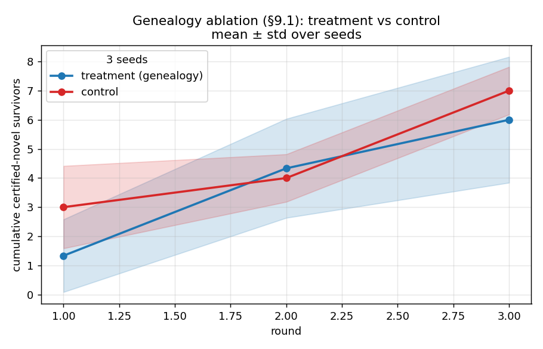
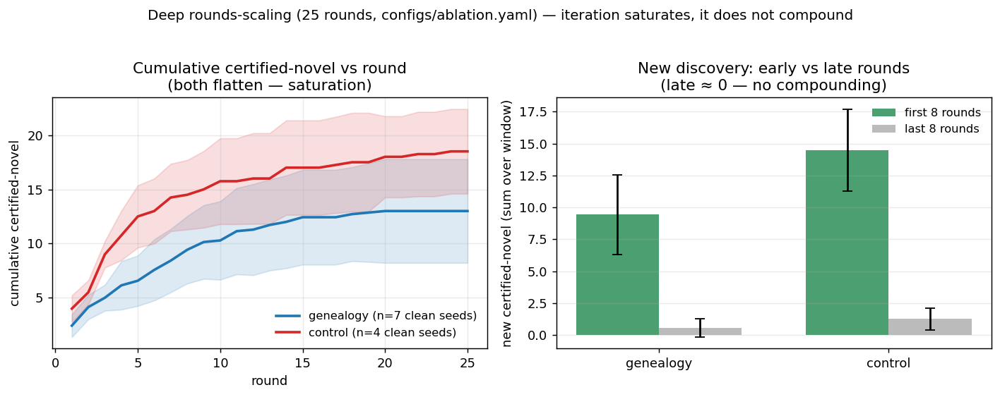
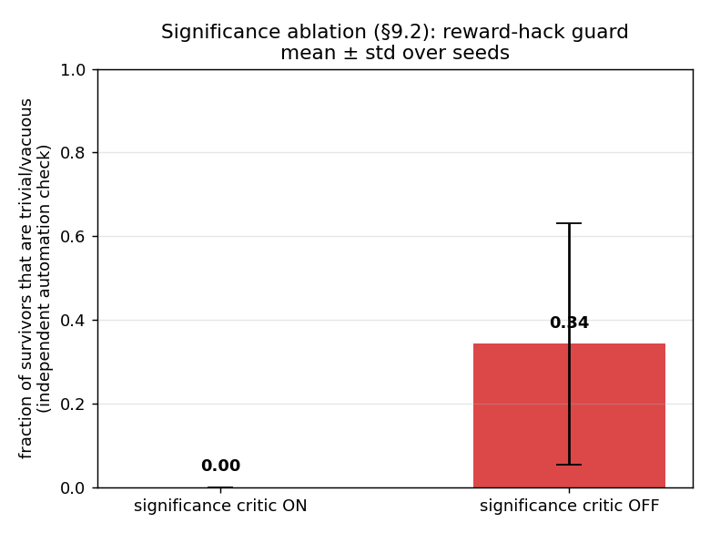
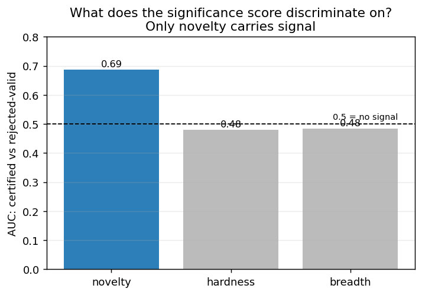
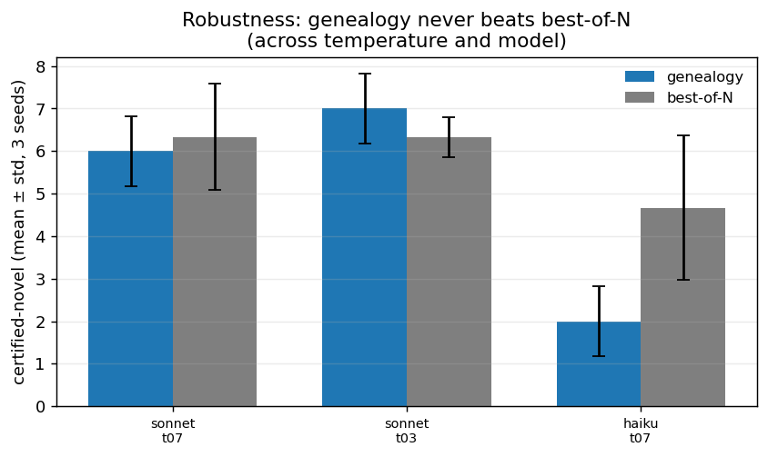

# Critical-Rationalist Machine (CRM) — prototype

A minimal but **real, end-to-end** prototype of a machine that searches for
**operationally-novel** small claims by **bold conjecture → severe automated
criticism → retention of survivors and of the reasoned genealogy of failures**,
rather than by predicting the human-text distribution.

> **What this prototype does and does NOT show (read first).** It demonstrates
> *operational* novelty — claims that are not corpus restatements, are not
> closeable by a degenerate-impl probe, and sit at embedding-distance >= 0.35
> from a static corpus — verified by **fuzz-testing on bounded integers, not by
> proof**. On the default number-theory domain the survivors are **classical
> textbook identities** (Mobius inversion = phi, sum phi(d) = n, sum floor(n/k) =
> sum d(n)): the system **rediscovers** them under criticism; it does not certify
> novel knowledge "against reality" and does not discover new mathematics. The
> **Lean formal-proof track produced 0 certified-novel survivors** at the demo
> budget — testing is not proving, and that gap is the honest centre of this
> report, not a footnote. A full, number-by-number account of the review-pass
> experiments is in [`docs/FINDINGS.md`](docs/FINDINGS.md).
>
> **Thesis-pass update (does iteration compound?).** Scaling the loop to **25
> rounds** shows it does **not**: ~94% of certified-novel appears in the first
> third of rounds and the late third yields ≈0 (genealogy late/early ratio 0.06,
> control 0.09) — the system **saturates** by round ~12–15, it does not compound.
> A diagnostic confirms the proposer genuinely *responds* to the genealogy
> context (proposal embedding-shift 0.47, near-zero statement overlap) yet this
> does **not** improve yield, and the significance score is empirically **just
> novelty** (breadth fires for <4% of survivors; hardness does not discriminate
> certified from rejected, AUC 0.48). The honest conclusion: a **frozen** proposer
> with **in-context** genealogy cannot create compounding novelty here; the
> regime that might (per the evidence) is **weight updates on survivors**, not
> richer prompting. See [`docs/findings/rounds_scaling.md`](docs/findings/rounds_scaling.md).

## Thesis (3 sentences)

Today's LLMs interpolate human knowledge; the open question is whether a
fit-to-text *objective* can be made to **certify knowledge against reality**
rather than against its own training distribution. We demote a **frozen** model
from a terminal objective to a **proposal distribution** ("imagination") and make
the primary signal **survival under severe automated criticism** (a Refutation
Engine; AlphaZero generalised to an open domain). In this prototype "against
reality" is operationalised as **execution-based fuzz-testing on a bounded
integer domain** — a proxy, not a proof, and not yet new mathematics. The two things that make this **not** RLVR / AlphaProof / Absolute
Zero: we condition the proposer on a **structured genealogy of *why* conjectures
failed** (those systems keep only pass/fail), and we score conjectures by
**explanatory content / hard-to-vary-ness** (those systems optimise mere
validity or solvability).

## The contribution is the ablations (not the loop)

The loop alone is **not** the point. The deliverable is the two apples-to-apples
experiments in [`REPORT.md`](REPORT.md), each isolating one of the two
differentiators against an otherwise-identical control (same proposer, model,
topic, k, rounds, critic, budgets, seed list — differing in exactly one variable):

- **Genealogy ablation (H2).** Treatment (`mode=genealogy`, the proposer sees
  *why* past conjectures died and which survivors to build on) vs control
  (`mode=control`, prior statements listed for dedup only, no reasons).
  
  *Reading (honest, scaled): at **n=8 seeds** with the real API proposer the
  treatment does **not** beat control — control is higher (4.88±1.96 vs
  6.88±2.57), the gap is not significant (Welch p=0.126, MWU p=0.134), and the
  trivial rate is a near-tie (treatment 0.271 vs control 0.258 — i.e. treatment
  is **not** lower).* Scaling from the original n=3 run did **not** rescue H2 on
  this recall-heavy domain; per the review we **demote the claim**. A
  freshly-defined sequence the model cannot recall briefly *looked* like the one
  place the sign flips positive (genealogy +1.33 vs control at n=3), but
  **scaling that to n=10 erased it**: genealogy 1.90±0.70 vs control 2.00±0.63,
  delta **−0.10** (Welch p=0.75, MWU p=0.77). So H2 is unsupported on **both**
  the easy and the hard domain — the n=3 flip was noise. See
  [`docs/FINDINGS.md`](docs/FINDINGS.md),
  [`docs/findings/genealogy_scale.md`](docs/findings/genealogy_scale.md), and
  [`docs/findings/hard_domain_scaled.md`](docs/findings/hard_domain_scaled.md).
  *Compounding (25 rounds, clean seeds):* genealogy still does not beat control
  (13.0±4.8 vs 18.5±3.9, p=0.11) and **both saturate** — new-certified collapses
  from ~9–15 in the first third of rounds to ≈0–1 in the last third. More rounds
  do not help; [`docs/findings/rounds_scaling.md`](docs/findings/rounds_scaling.md).
  

- **Significance ablation (reward-hack guard).** Trivial/vacuous "survivors" rate,
  significance critic ON vs OFF, judged by a **genuinely independent** triviality
  oracle that shares no code with the gate (review finding #5).
  
  *Reading: with the corrected non-tautological oracle (offline floor, 5 seeds)
  the guard ON drops the independently-measured trivial-survivor rate from
  0.27±0.08 to 0.15±0.07 — a real but **smaller and noisier** reduction than the
  old self-measuring probe's 0.34→0.00 (now retired). Even ON, ~15% of survivors
  are still flagged guess-closeable.*

## Headline KPI (the "certified-novelty-per-compute" benchmark)

From the **real** sandboxed code-exec critic demo (`metrics.json`):

| metric | value |
| --- | --- |
| certified-novel survivors | **7** raw (seed 0; of 18 conjectures, 3 rounds) — but **only 4 distinct** after intra-run dedup (finding #7) |
| `certified_novel_per_kilo_token` | **0.756** (on the raw count of 7) |
| critic compute | **0.58s** total (~**32 ms**/conjecture) |

**Caveats on this headline (do not over-read).** (1) The 7 raw survivors collapse
to **4** clusters under the run's own embedder at delta=0.35 — 3 are intra-run
near-duplicates ([`docs/findings/dedup_collapse.md`](docs/findings/dedup_collapse.md)).
(2) A naive **best-of-N + dedup baseline keeps ~1.7x more** certified items per
kilo-token than the full pipeline; the full system trades throughput for a
modest, noisy quality gain, not a per-token win
([`docs/findings/baseline.md`](docs/findings/baseline.md)).
(3) We report critic cost as measured seconds-per-survivor, **never** an hourly
rate: annualizing a 0.58s sample to a "per critic-hour" figure (~43k) is a
~6000× extrapolation. Any `certified_novel_per_critic_hour` key that appears in a
regenerated `results/*/metrics.json` is a stray artifact of an older run, is
**not** emitted by the current accounting code, and is **disavowed** — the
tracked `metrics.json` correctly omits it.

The top survivors — each with its verifiable proof/tests, significance breakdown,
and the **failed genealogy siblings that explain why they died** — are in
[`docs/SURVIVORS.md`](docs/SURVIVORS.md). None is hand-authored; all came from the
loop. The full run is also browsable in the offline
**[replay viewer](docs/replay/index.html)** (see *Shareable links* below).

## Findings (updated review pass)

Follow-up experiments were run to stress-test the claims above; two were then
**re-run at higher power** to settle them (hardness with 8-vs-11 candidates;
the hard domain at n=10). **Every number is reproduced from a committed result
file; null/unfavorable results are reported as such.** Full account:
[`docs/FINDINGS.md`](docs/FINDINGS.md). One code-review note: the rich
perturbation operator defaults to `"literal"` in production configs (only
`configs/hard_domain.yaml` sets `rich`), so the headline path still uses the old
operator — the rich/`rich_false` work is validated but not yet wired into the
live `is_trivial` gate.

| # | finding | headline (real numbers) | doc |
| --- | --- | --- | --- |
| 7 | **Intra-run dedup** | 7 certified survivors collapse to **4** distinct clusters (3 are near-dups) at delta=0.35; gate now blocks dups at admission | [dedup_collapse](docs/findings/dedup_collapse.md) |
| 6 | **Hardness perturbation** (settled, 8 vs 11) | richer *operator* alone fails (rich_any gap +0.09, ILLFORMED-inflated); the **metric** fix works — `rich_false` (count only FALSE counterexamples) separates contentful 0.74 vs trivial 0.55 (p=0.003), but only modestly | [hardness_scaled](docs/findings/hardness_scaled.md) |
| 3 | **Genealogy at scale (H2)** | n=8 API: genealogy **4.88±1.96** vs control **6.88±2.57**, **−2.00**, not significant (p=0.126). H2 not established → **demoted** | [genealogy_scale](docs/findings/genealogy_scale.md) |
| 5 | **Independent triviality oracle** | non-tautological oracle: guard ON **0.15±0.07** vs OFF **0.27±0.08** (was 0.00 vs 0.34, now retired) | REPORT §9.2 |
| 8 | **Best-of-N baseline** | baseline keeps **1.7x more** certified/ktok (17.85 vs 10.60); full system is a cost/quality trade-off, not a per-token win | [baseline](docs/findings/baseline.md) |
| 9 | **Hard domain (discovery), settled at n=10** | on a non-recallable sequence the n=3 genealogy flip (+1.33) **vanished**: genealogy **1.90±0.70** vs control **2.00±0.63** (−0.10, p=0.75). best-of-N wins (+1.10, p=0.003). H2 unsupported on both domains | [hard_domain_scaled](docs/findings/hard_domain_scaled.md) |

A second **thesis-pass** then asked *why* and *whether iteration compounds*:

| # | finding | headline (real numbers) | doc |
| --- | --- | --- | --- |
| C1 | **Does iteration compound?** (25 rounds) | **No — it saturates.** New-certified collapses from ~9–15 (first ⅓) to ≈0–1 (last ⅓); plateau ~round 14. Genealogy still ≤ control (13.0 vs 18.5, p=0.11). Fallback-contaminated seeds excluded | [rounds_scaling](docs/findings/rounds_scaling.md) |
| C2 | **Does the proposer use the genealogy?** | **Yes, but it doesn't help.** Proposals shift a lot with genealogy context (embed-dist 0.47, statement Jaccard 0.03) yet yield doesn't improve → not a prompt bug | [responsiveness](docs/findings/responsiveness.md) |
| C3 | **Is the result model/temp-specific?** | **No.** genealogy never significantly beats best-of-N across temp 0.3/0.7 and a 2nd model (haiku); no fallback contamination | [robustness](docs/findings/robustness.md) |
| C4 | **What does the significance score measure?** | **Just novelty.** Only novelty discriminates certified vs rejected (AUC 0.69); hardness AUC 0.48, breadth AUC 0.48 are noise. Breadth fires for <4% of survivors → 0.3 of the score is dead weight | [significance_depth](docs/findings/significance_depth.md) |
| C5 | **Can a better genealogy prompt rescue H2?** | **No (REFUTED).** Swapping "build on these" for an orthogonality directive did not make genealogy beat control/best-of-N | [hyp_H-orthogonality](docs/findings/hyp_H-orthogonality-prompt-flips-h2.md) |

| | |
|---|---|
|  |  |

*Left (C4): only **novelty** separates certified from rejected (AUC 0.69); hardness and breadth sit at chance (0.48). Right (C3): genealogy never significantly beats best-of-N across temperature and model. All figures are regenerated from real result files by `experiments/make_thesis_plots.py`.*

## One-command reproduction

```bash
make install        # editable install (numpy, pyyaml, matplotlib, anthropic, dotenv, sentence-transformers)
make demo           # REAL sandboxed code-exec critic -> results/<run>/{ledger.jsonl,metrics.json,artifacts.json}
```

Then regenerate the curated artifacts from that run:

```bash
make ablation                              # both experiments (>=3 seeds) + plots + REPORT.md
python -m experiments.make_survivors       # SURVIVORS.md from the latest real run
```

Other targets: `make smoke` (full loop on the **mock** critic in <60s — for
architecture validation only, never a reported result), `make test` (pytest incl.
the §5.2 perturbation/triviality fixtures).

The proposer uses a real Anthropic model when a key is present in a gitignored
`.env` (`CRM_PROPOSER_PROVIDER`, `CRM_PROPOSER_MODEL`, `ANTHROPIC_API_KEY`); with
no/invalid key it degrades to a **deterministic offline candidate generator**, so
`make demo` still produces real-critic-verified survivors offline.

### Lean (formal-proof) track — the honest tell: 0 survivors

`scripts/setup_lean.sh` installs `elan`, pins a Lake project to a stable mathlib,
and runs `lake exe cache get` (prebuilt oleans — the setup-time trick). Then:

```bash
make demo CONFIG=configs/lean_nt.yaml      # Lean 4 / mathlib critic, number theory
```

**This is the load-bearing caveat, stated up front, not buried.** Everything the
code-exec critic certifies is verified by **fuzz-testing on bounded integers —
not proof**. The Lean track is the only path here that would constitute actual
formal verification, and at the demo budget it produced **0 certified-novel
survivors**: the toolchain really compiles candidates via `lake env lean`, but
most candidates hit `UNPROVEN_BUDGET` and the one that proved did not clear the
significance critic. So the gap between "passes tests on small inputs" and
"proved" is **not** closed by this prototype. The code-exec headline is the
**floor** the build plan permits (§13/§14); closing the formal track needs more
proof budget and proof-search retries (see [`ROADMAP.md`](ROADMAP.md)). Read the
"certified-novel" numbers throughout this repo with that distinction in mind.

## Shareable links (offline replay + GitHub Pages)

The whole run is browsable with **zero setup** in a single self-contained,
vanilla-JS page — no build step, no API, no Lean, no network:

- **[`docs/replay/index.html`](docs/replay/index.html)** — double-click it (or
  serve `docs/`) to replay the real run: a scrubbable round-by-round timeline,
  conjecture cards coloured by `reason_class` (PROVED / FALSE / UNPROVEN_BUDGET /
  TRIVIAL / DUPLICATE), each showing the statement, gloss, refutation detail, the
  three significance mini-bars (novelty / breadth / hardness) + a certified-novel
  badge, and — under each survivor — the **failed siblings** the genealogy
  explains. Filter toggles: all / survivors only / certified-novel only.
  It reads **only** the committed, sanitized [`docs/replay/run.jsonl`](docs/replay/run.jsonl)
  (a real `ledger.jsonl` with keys/paths stripped).

The rendered report and survivors live under `docs/` too:
[`docs/REPORT.md`](docs/REPORT.md) · [`docs/SURVIVORS.md`](docs/SURVIVORS.md) ·
plots in `docs/assets/`.

**GitHub Pages (one setting to flip).** The repo is already structured to serve
`docs/`. After pushing, in the repo **Settings → Pages**, choose
**Deploy from a branch → Branch: `main`, Folder: `/docs`**, Save. The replay
viewer is then live at:

```
https://<user>.github.io/<repo>/replay/
```

`make publish` regenerates the plots, refreshes the curated `docs/` assets, runs a
**secret-scan over tracked files** (fails loudly on any leaked API key, `.env`
assignment, or host path), then **prints** (does not execute) the
`git remote add … && git push`
and the Pages-toggle steps. `make record` captures `make demo` to `docs/demo.cast`
with `asciinema` if installed (else prints a screen-recorder / Loom note).

## IP mode (what the public repo tracks)

`scripts/prep_public.sh --mode {results-only|full}` chooses how much of the moat
ships publicly:

- **`results-only`** (default) — track `README.md`, all of `docs/` (report,
  survivors, replay, plots), and the loop/critic **interfaces**, but keep the two
  load-bearing critic sources — the hard-to-vary `crm/significance.py` (§5.2) and
  the reasoned `crm/genealogy.py` (§5.1) — out of the public tree by relocating
  them into a gitignored `PRIVATE/` (shared with reviewers separately). Protects
  the moat during the competition while still giving a public, rendered,
  interactive link.
- **`full`** — track everything, including the significance + genealogy sources.

Add `--dry-run` to print exactly what *would* be excluded/moved without touching
the working tree:

```bash
scripts/prep_public.sh --mode results-only --dry-run   # non-destructive preview
```

## How this differs from RLVR / AlphaProof / Absolute Zero

Those systems keep only **pass/fail** and optimise **validity / solvability**. We
keep a **reasoned genealogy** (*why* each conjecture failed — refuted-with-
counterexample, rejected-trivial-with-hardness) and feed it back in-context, and
we add a **significance critic** that computes **hard-to-vary-ness**: a contentful
theorem is surrounded by false neighbours (high hardness), a trivial truth is not
(low hardness). That is what suppresses the "it compiled" reward-hack and is what
the §9 ablations measure. If the genealogy ever degraded to pass/fail, or
significance to "it compiled," the novelty would be gone (§15).

## Honest limits (read this)

- **Frozen proposer.** No weight updates in this prototype; the genealogy and
  significance mechanisms are demonstrated via **in-context** conditioning only.
  Weight-update RL is Tier-1 future work — see [`ROADMAP.md`](ROADMAP.md).
- **Operational — not formal — novelty; testing is not proof.** `certify_novel`
  is a corpus-match + automation + embedding-distance **proxy**, and validity is
  **execution-based fuzz-testing on bounded integers**, not a proof. The Lean
  formal track produced **0** certified-novel survivors at the demo budget (above)
  — that gap is real and unclosed. **Formal independence** is a Stage-1/2
  deliverable, not claimed here.
- **Rediscovery, not discovery (on the default domain).** The survivors are
  classical textbook number-theory identities; the model can recall them, so the
  default domain tests **recall**, not discovery. A separate non-recallable
  domain ([`docs/findings/hard_domain.md`](docs/findings/hard_domain.md)) tests
  discovery and produces genuinely-discovered survivors, but is underpowered.
- **Intra-run duplicates.** The headline run's 7 raw certified survivors are only
  **4** distinct under embedding dedup; 3 were near-duplicates of each other
  (finding #7, since gated).
- **Genealogy (H2) is not established.** Scaled to n=8 with the API proposer the
  genealogy treatment does **not** beat control (4.88±1.96 vs 6.88±2.57, not
  significant) and its trivial rate is **not** lower than control's. Per the
  review we demote the H2 claim; see [`docs/FINDINGS.md`](docs/FINDINGS.md).
- **No per-token win.** A best-of-N + dedup baseline keeps ~1.7x more certified
  items per kilo-token; the full loop is a cost/quality trade-off, not a per-token
  win (finding #8).
- **Small scale.** A miniature artifact: ~18 conjectures over 3 rounds. The
  ablations scale the genealogy arm to n=8 seeds but remain modestly powered.
- **The mock critic is never a result.** `MockCritic` validates the
  loop/ledger/accounting/harness in seconds; no reported number uses it (§3).
- **API non-determinism.** With the API proposer, sampling is seeded but the
  endpoint is not bit-reproducible; the offline generator is fully deterministic.

## Layout

See [`BUILD_SPEC.md`](BUILD_SPEC.md) §4. The three load-bearing components (§5):
the genealogy ledger + conditioning (`crm/genealogy.py`), the hard-to-vary
significance critic (`crm/significance.py`, `crm/perturb.py`), and operational
novelty certification (`crm/novelty.py`). Critics live in `crm/critics/`
(`mock.py`, `code_exec.py` + `sandbox.py`, `lean.py`); the loop is `crm/loop.py`;
accounting is `crm/accounting.py`; experiments + report/survivors generators are
in `experiments/`.
